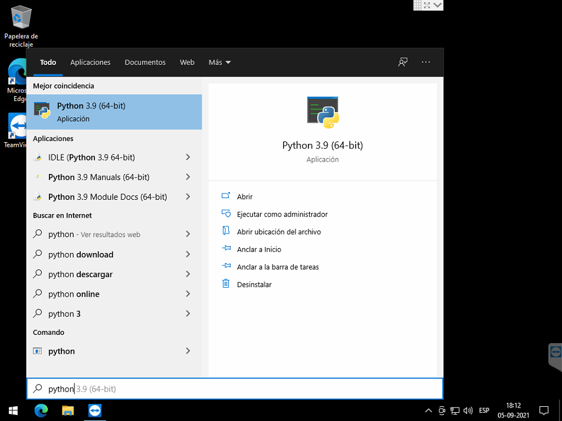
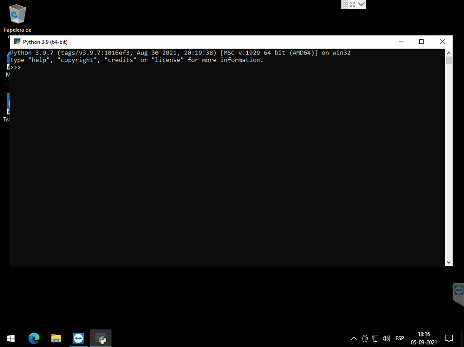
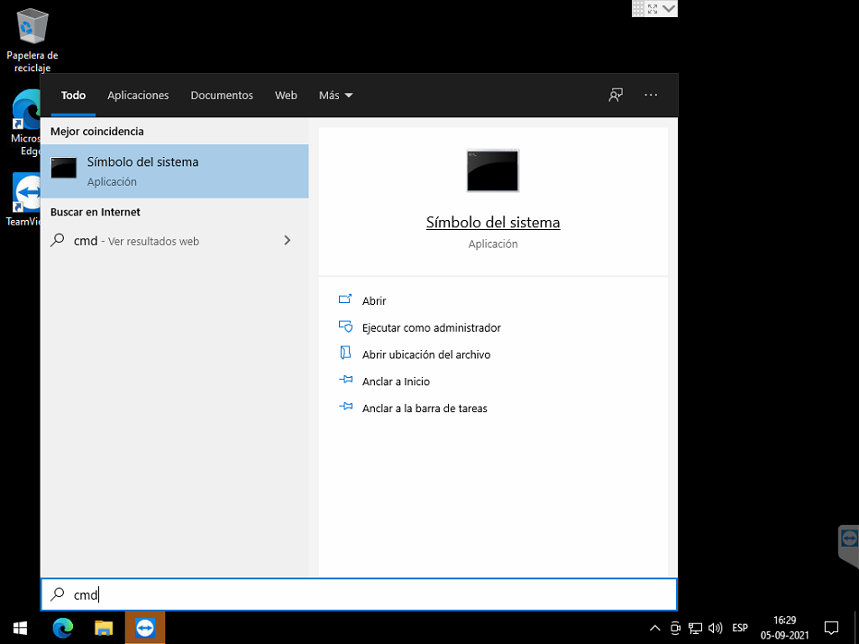
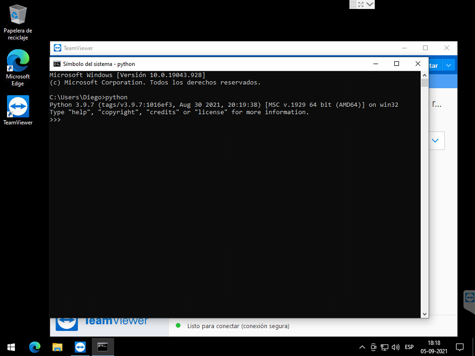

# Python Shell vs Python IDLE

[TOC]

## Introducción

Cuando descargas Python desde su [sitio web oficial](https://www.python.org/). Se instalan dos programas Python Shell y Python IDLE. Esto puede ser confuso para muchos. Pero no deben complicarse.

## Python Shell

Python Shell es una herramienta de línea de comandos que inicia el intérprete de python. Puedes probar programas simples y también escribir algunos programas cortos. Sin embargo, para escribir un programa python más complejo necesitas un editor. 

La [shell](https://es.wikipedia.org/wiki/Shell_(informática)) de python se puede iniciar de dos formas. La primera es buscando el programa que la ejecuta con el **Buscador de Windows**, la segunda es accediendo desde el símbolo del sistema (cmd).

| Buscar programa                           | Terminal                                      |
| ----------------------------------------- | --------------------------------------------- |
|  |            |
|           |  |

Para ejecutar un archivo con la shell de python debes usar el comando `python <archivo.py>`

## IDLE de Python

El IDLE de Python combina las dos necesidades anteriores y las ha agrupado como un paquete. IDLE consiste en un Shell de Python, y un editor de texto que soporta resaltados para la gramática de python, etc.

| Descripción                                                  | Imagen                                                 |
| ------------------------------------------------------------ | ------------------------------------------------------ |
| Abrir el IDLE                                                |        |
| Al abrir el IDLE de Python, presionando sobre "Nuevo archivo" accedes al editor de código. En este editor puedes escribir tus programas de python. |  |
| Luego puedes guardar tus cambios presionando sobre ... y luego en Guardar o con la abreviación de teclas ctrl+g. |             |
| Para ejecutar el programa debes presionar sobre ... o utilizar la tecla f5. |            |
