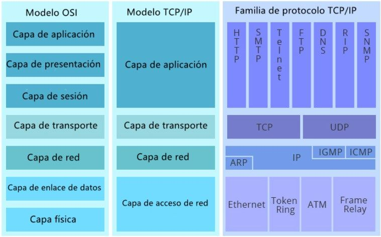

# Modelos y protocolos de red

[TOC]

## Qué es un protocolo

En informática y telecomunicaciones, hablamos de un protocolo para referirnos a un **sistema de normas** que regulan la comunicación entre dos o más sistemas que se transmiten información a través de diversos medios físicos.

De los protocolos depende, entonces, **hacer que dos o más sistemas informáticos puedan comunicarse de manera eficaz y ordenada**, es decir, que hablen un mismo idioma. Estos lenguajes se implementan mediante hardware o software, o combinaciones de ambos, y le brinda a cada participante en la comunicación una identidad y un método específico de procesamiento de la información.

## Modelo TCP/IP y OSI

|   Tanto el Modelo OSI como el Modelo TCP/IP separan las funciones que realiza un computador para enviar y recibir datos. Sin embargo presentan numerosas diferencias. La más notoria es que el primero cuenta con 7 capas y el segundo con 4. Lo normal es que cuando deseemos implementar una red o descubrir los problemas que esta presenta nos refiramos al Modelo OSI. Sin embargo, el modelo OSI es puramente conceptual y el TCP/IP representa de mejor forma la lógica real de las conexiones en internet.   |  |
| ---- | ------------------------------------------------------------ |

## La familia de Protocolos TCP/IP

Como se dijo anteriormente TCP/IP es un modelo que divide las funciones que desempeña un computador en la comunicación. Pero también es una familia de protocolos de comunicación de los cuáles los más importantes son TCP (Transmission Control Protocol) e IP (Internet Protocol). Esta familia de protocolos es el estándar de comunicación entre dispositivos mediante internet. Por este motivo, todos los fabricantes de computadores cumplen las especificaciones de hardware necesarias para que el dispositivo pueda conectarse a la red. Lo mismo hacen los desarrolladores de sistemas operativos que instalan por defecto el software necesario para establecer esta conexión.

Cada protocolo cae en una capa en particular y se preocupa de desempeñarse en una función determinada. Esto se puede observar en la imagen a continuación.

### Protocolos de la capa de acceso de red

No los considero tan relevantes para este curso.

### Protocolos de red

Los protocolos de red están especialmente diseñados para la comunicación a través de redes de computadoras, que operan fragmentando la información enviada en pequeñas partes, en lugar de todo de golpe. Las partes son fáciles y rápidas de transmitir, pero deben almacenarse en el orden correcto para conservar la información intacta.

Algunos de los protocolos de red más importantes en la actualidad son:

- IP (Internet Protocol)
- ARP (Address Resolution Protocol)
- ICMP (Internet Control Message Protocol)
- OSPF (Open Shortes Path First)
- RIPv2 (Routing Information Protocol version 2)

#### IP: IPv4 e IPv6

De todos los protocolos de la capa de red, el más importante es **el protocolo IP, pues permite que los equipos se identifiquen** dentro de la red otorgándoles una **dirección ip**. Este se divide en dos estándares IPv4 e IPv6 que se diferencian por el número de host que permiten identificar.

IPv4 es una versión del protocolo que considera un identificador de 32 bit. Esto quiere decir que es un número compuesto por 32 número binarios. Lo que implica que este considera un total de 2^32 direcciones IP (4.2 billones de direcciones IP). IPv6 es una versión del protocolo que considera un identificador de 64 bit. El total de direcciones que puede otorgar a los equipos es de 2^64 direcciones IP (340,282,366,920,938,463,463,374,607,431.7 billones de direcciones IP).

Esta gran diferencia radica en el hecho de que cuando se creó el protocolo IPv4 existían muy pocas computadoras en el mundo y se pensó que nunca alcanzaríamos a tener más de 4.29 billones de dispositivos conectados a internet. Pero el tiempo ha dicho lo contrario. Hoy en día existen muchos más dispositivos conectados a la red. Es por esto que se concibió IPv6, con un identificador más largo. A día de hoy se sigue usando el protocolo IPv4, y se usan "trucos" para que no se acaben las direcciones IP. Sin embargo, podemos esperar que en un futuro próximo se abandone el uso del protocolo y se reemplace por su hermano menor IPv6.

### Protocolos de Transmisión (transporte) de los paquetes de datos

Los protocolos de transmisión o de transporte de datos se encargan de proporcionar una conexión de datos fiable entre dos dispositivos. Divide los datos en paquetes, hace acuso de recibo de los paquetes que recibe del otro dispositivo y se asegura de que el otro dispositivo haga acuse de recibo de los paquetes que recibe a su vez.

## Bibliografía

[Protocolo Informático - Concepto, propiedades y ejemplos](https://concepto.de/protocolo-informatico/)

https://www.ionos.es/digitalguide/servidores/know-how/los-protocolos-de-red-en-la-transmision-de-datos/

[¿Cuál es la diferencia entre modelo OSI y modelo TCP/IP? | FS comunidad](https://community.fs.com/es/blog/tcpip-vs-osi-whats-the-difference-between-the-two-models.html)

[Familia de protocolos TCP/IP - EcuRed](https://www.ecured.cu/Familia_de_protocolos_TCP/IP)

[Protocolos TCP/IP - Documentación de IBM](https://www.ibm.com/docs/es/aix/7.2?topic=protocol-tcpip-protocols)

[Protocolos de comunicación de redes (kionetworks.com)](https://www.kionetworks.com/blog/data-center/protocolos-de-comunicación-de-redes)

[¿Qué es un protocolo de red? Definición y tipos de protocolos - IONOS](https://www.ionos.es/digitalguide/servidores/know-how/los-protocolos-de-red-en-la-transmision-de-datos/)

[¿Qué es TCP/IP? | Cómo funcionan el modelo y los protocolos | Avast](https://www.avast.com/es-es/c-what-is-tcp-ip)

[IPv4 vs. IPv6 Benefits - What is it? | ThousandEyes](https://www.thousandeyes.com/learning/techtorials/ipv4-vs-ipv6#:~:text=IPv4 stands for Internet Protocol,IP address such as 99.48.)

[Características de IPv4 e IPv6 (rootear.com)](https://rootear.com/web/diferencias-entre-las-versiones-del-protocolo-tcpip)
