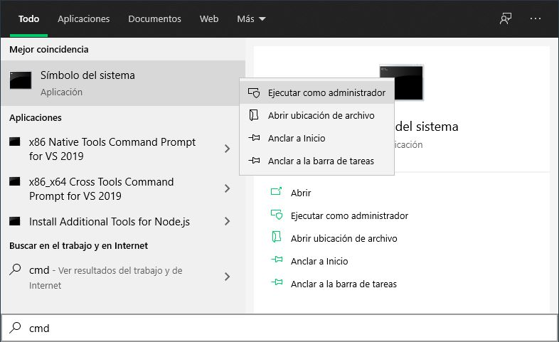
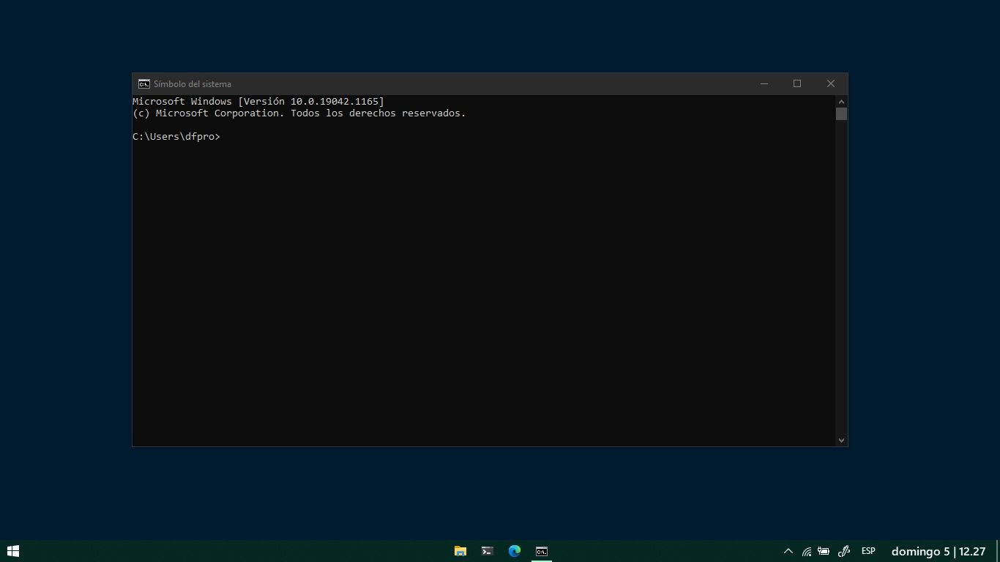
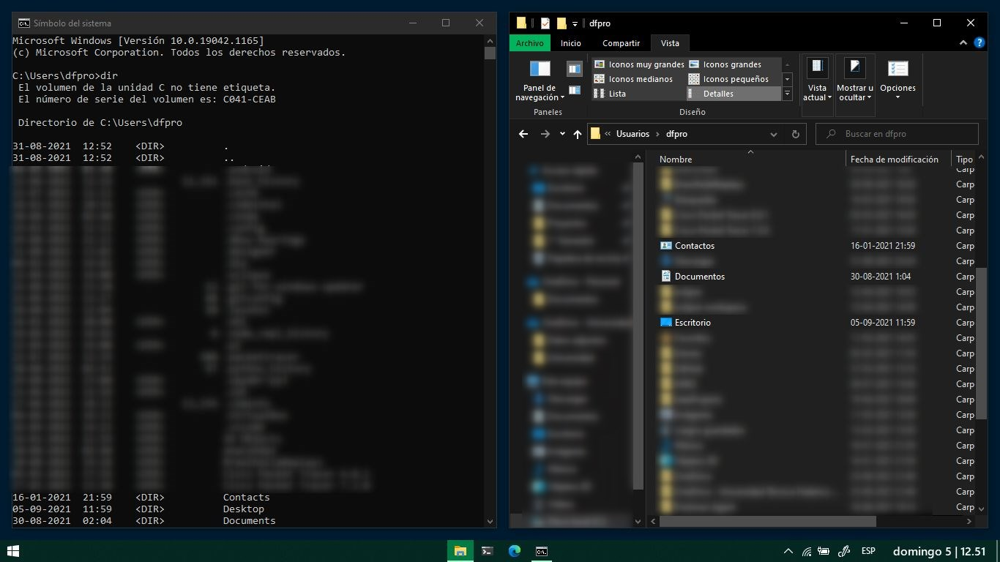
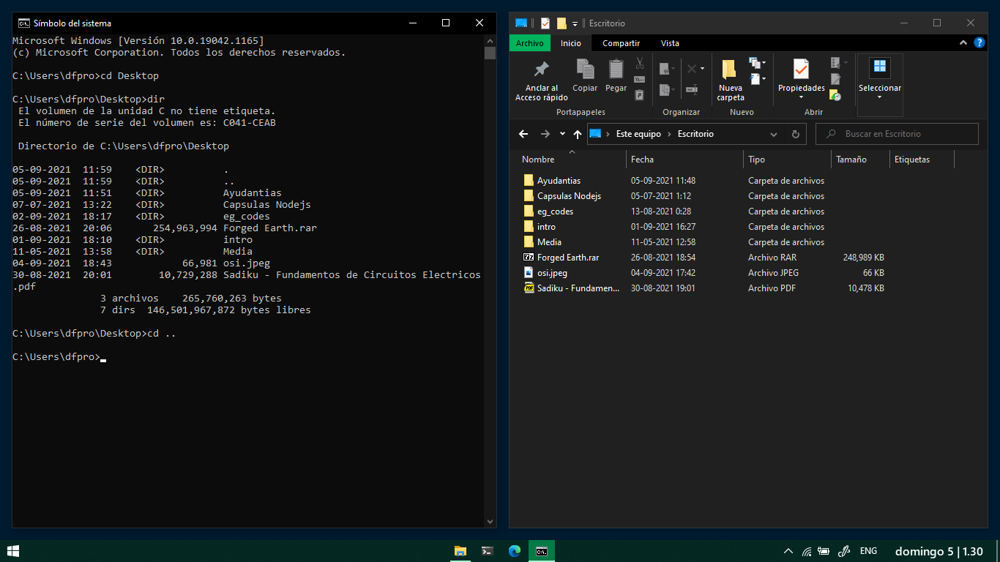
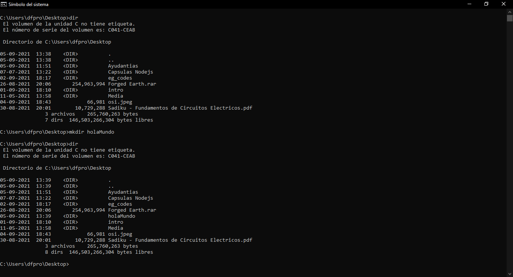
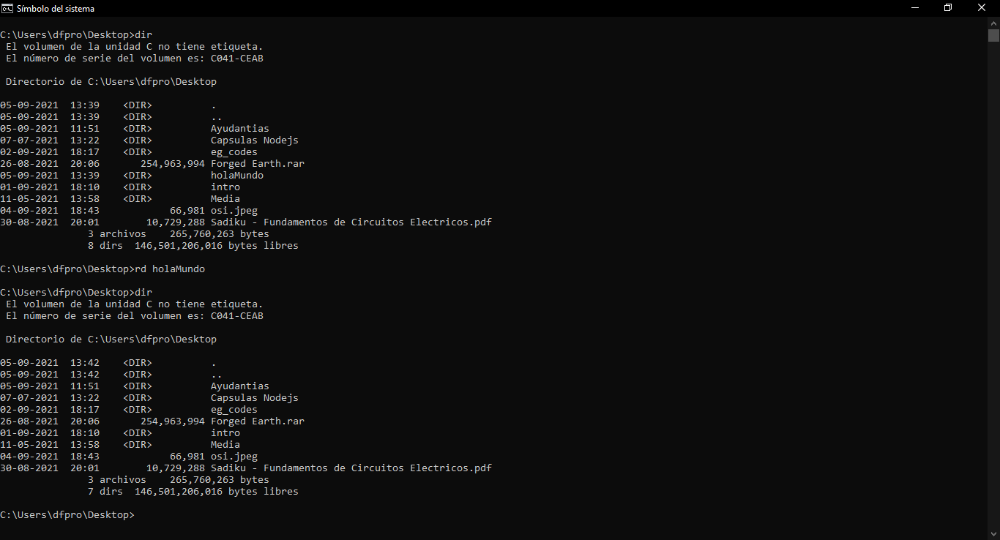
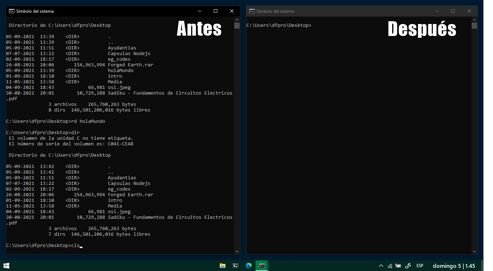
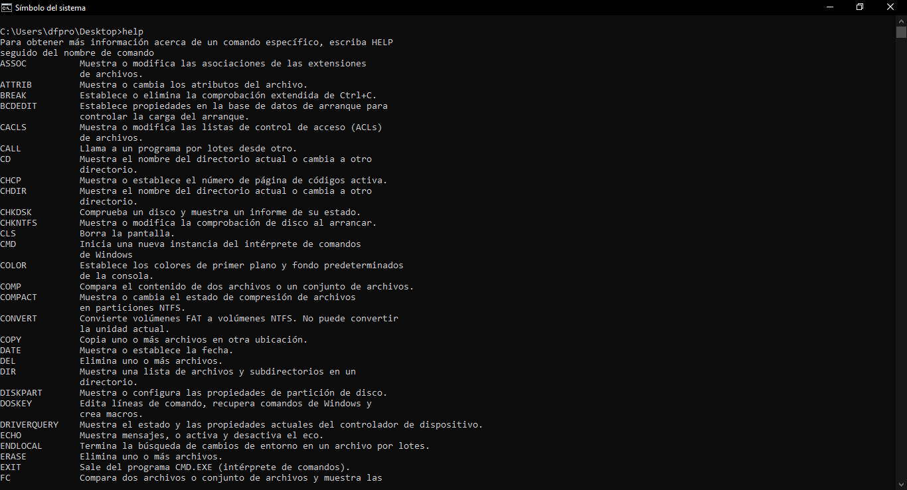

# CMD (Símbolo del sistema)

[TOC]

## Introducción

El **CMD, Command Prompt, Símbolo del sistema**, es una herramienta de Windows que te permite realizar acciones en el sistema operativo usando **comandos de texto**. Comúnmente preferida por los usuarios avanzados, se esconde a los usuarios novatos para prevenir que ejecuten comandos que puedan modificar el sistema.

El cmd es una herramienta que peca de una interfaz tal vez demasiado sencilla. Está totalmente basado en texto, con un texto blanco sobre fondo negro. Sin embargo, es especialmente útil para automatizar tareas mediante secuencias de comandos y archivos por lotes, así como para llevar a cabo funciones administrativas avanzadas y solucionar muchos problemas en Windows.

## Acceder al cmd

1. Existen varias formas de acceder al cmd. Sin embargo la más sencilla es buscarlo con el **Buscador de Windows** y luego abrirlo de forma normal o como administrador. Sin lo abres como administrador podrás usar más comandos, pero debes tener cuidado porque si no sabes bien lo que hacen alguno de ellos puede dañar tu sistema operativo.

## Comandos Básicos

Después de seguir los pasos anteriores, se mostrará la línea de comandos, el cmd, de Windows. Si ejecutaste el cmd como administrador, Windows abrirá esta ventana en el directorio raíz del sistema operativo: System32. Si por el contrario, lo ejecutaste sin permisos de administrador, Windows abrirá esta ventana en el directorio de usuario.

### Listar contenido del directorio (dir)

Puedes ver el contenido de un directorio mediante el comando `dir`. Puedes comprobar el funcionamiento de dicho comando abriendo el mismo directorio con el explorador de archivos de Windows y comparando su contenido.

|                     |
| ------------------------------------------------------------ |
| -  He nublado a propósito muchos de los archivos que tengo en el directorio por privacidad. |
| - Aquellas filas que dicen "<DIR>" son directorios (carpetas). |
| - Aquellas filas que no dicen "<DIR>" son ficheros (archivos). |
| - Algunos archivos y directorios pueden aparecer en inglés al listarlos en la terminal. |
| - El directorio "." hace referencia al directorio actual.    |
| - El directorio ".." hace referencia al directorio padre.    |

### Navegar por el sistema (cd)

Otra cosa que uno puede hacer con la terminal es moverse por los distintos directorios del sistema. Para eso se puede ocupar el comando `cd`. 

| Descripción                    | Comando                    |
| ------------------------------ | -------------------------- |
| Ir hacia un directorio         | cd <nombre del directorio> |
| Devolverse al directorio padre | cd ..                      |

### Crear directorios (mkdir)

En el siguiente ejemplo se puede observar que se ha creado el directorio holaMundo dentro del directorio C:\Users\dfpro\Desktop.

### Eliminar un directorio (rd)

En el siguiente ejemplo se puede observar que se ha eliminado el directorio holaMundo dentro del directorio C:\Users\dfpro\Desktop.

### Limpiar la consola (cls)

Para limpiar la consola se puede usar el comando `cls`. En el siguiente ejemplo he abierto dos consolas para mostrar el antes y el después de aplicar el comando.

### Buscar comandos (help)

A menudo olvidarás los comandos que puedes utilizar dentro del cmd. Por esto razón, la herramienta incluye un comando que te permite buscar los comando más utilizados. Este comando es `help`.

## Bibliografía

Me he basado en la siguiente página web. En ella pueden encontrar la explicación de más comandos:

​	[Que es CMD ¿Que significa y para que sirve? (profesionalreview.com)](https://www.profesionalreview.com/2018/06/30/que-es-cmd/#Que_es_el_Simbolo_del_Sistema)

